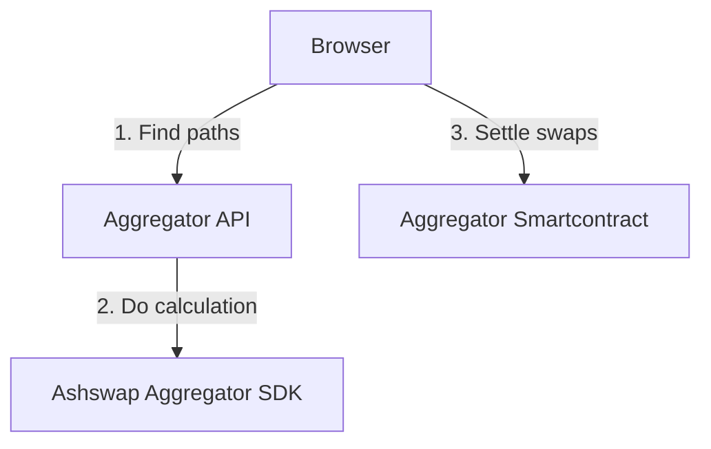
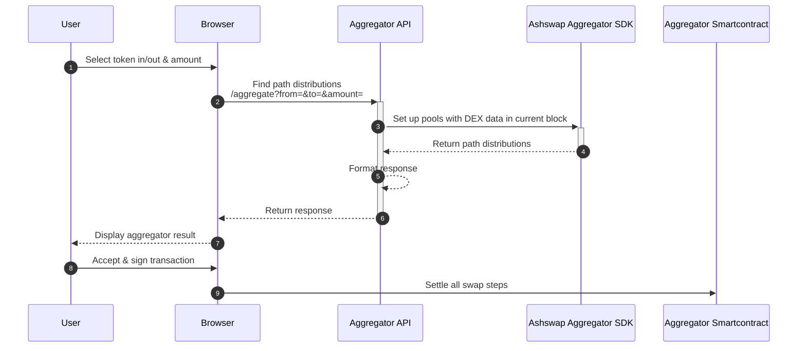
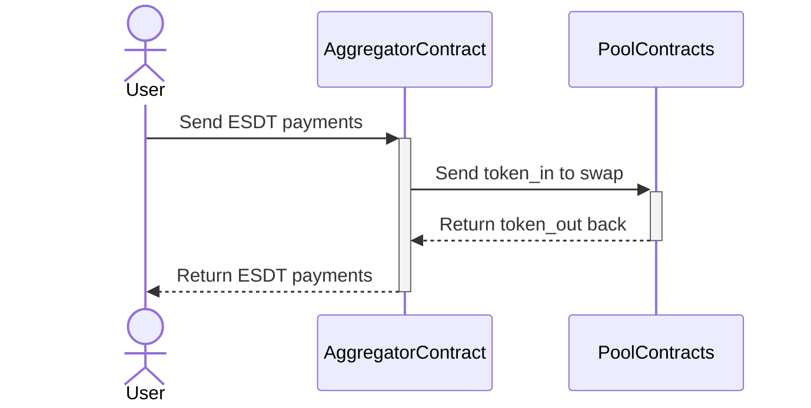
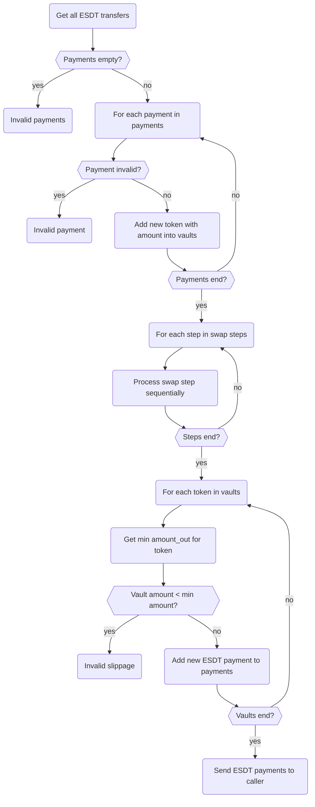
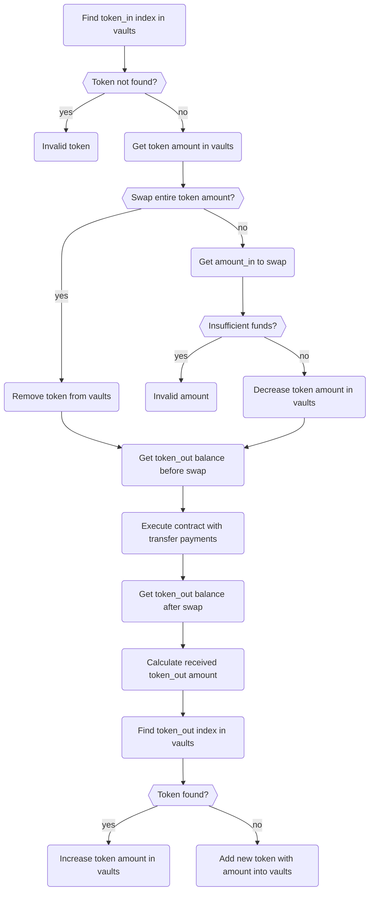

# Aggregator System

# Overview
## What is DEX Aggregator?
In the world of Decentralized Finance (DeFi), we have two eras of aggregator systems:
- **Static Trade Routing:** Aggregators help users find the best paths for swapping tokens. Users can choose the desired path, and the system usually presents them with sorted results, highlighting the most favorable options.
- **Dynamic Trade Routing:** This is an improvement upon Static Trade Routing. After finding all possible paths, the aggregator system distributes the input token amount across different paths to achieve the best possible price. Unlike Static Trade Routing, which relies on a single path, Dynamic Trade Routing provides better outcomes by leveraging multiple paths.
## How does Dynamic Trade Routing achieve the best outcome
In a decentralized exchange (DEX), when attempting to swap a large amount of Token A for Token B using a single path, the price of Token B increases proportionally due to the depletion of liquidity along that path. Dynamic Trade Routing addresses this issue by dividing the large token amount into smaller portions and executing swaps across multiple paths. As a result, the price of Token B increases less compared to the previous approach.
## AshSwap Aggregator
AshSwap Aggregator utilizes Dynamic Trade Routing to offer users the best price for token swaps across multiple DEXes. It combines *smart contracts and a backend system* to find the optimal distribution of swaps among different DEXes, ensuring users get the most favorable prices. The system is designed to be modular and extensible, allowing for the inclusion of new DEXes and strategies to continuously improve the search for the best price.

# Architecture
## High-level Architecture


#### Sequence diagram


## Low-level Architecture
### Aggregator Service
A RESTful API that exposes Ashswap Aggregator SDK to the world. It is a NestJS application that can be deployed to any cloud provider. It is designed to be modular and extensible, allowing for the inclusion of new DEXes and strategies to continuously improve the search for the best price. It has two main components:
- **Aggregate API**:
  
| Endpoint  | /aggregate  |
|------------------------|-----|
| Method | GET |

| Argument name  | Description  |
|------------------------|-----|
| from | Input token ID |
| to | Output token ID |
| amount | Amount of input token with decimals |

E.g. A request to swap from 100 WEGLD (decimals = 18) to ASH.`/aggregate?from=WEGLD-bd4d79&to=ASH-a642d1&amount=100000000000000000000`

| Response                   | Description  |
|------------------------|-----|
| tokenIn | Input token ID |
| tokenOut | Output token ID |
| swapAmount | Input amount (no decimals)  |
| returnAmount | Output amount (no decimals) |
| returnAmountWithoutSwapFees | Ouput amount without swap fees |
| marketSp | Market spot price before swap |
| effectivePrice | Market spot price for current swap |
| priceImpact | Price impact |
| tokenAddresses | Array of token IDs |
| swaps | An array of **Swap Step**. This value will be used to compute the *an argument to interact with smartcontract* |
| routes | An array of **Route**. This value will be used to *display on UI* |

| Swap Step                   | Description  |
|------------------------|-----|
| poolId | Pool ID |
| assetInIndex | Pool index of input token |
| assetOutIndex | Pool index of output token |
| assetIn | Input token ID |
| assetOut | Output token ID |
| amount | Input token amount with decimals. If amount = 0 means all amount from the previous step will be used to swap in this step|
| returnAmount | Return amount with decimals |
| functionName | Function name to call |
| arguments | Function arguments |

| Route                  | Description  |
|------------------------|-----|
| tokenIn | Input token ID |
| tokenInAmount | Input token amount with decimals |
| tokenOut | Output token ID |
| tokenOutAmount | Output token amount with decimals |
| hops | An array of **Hop** |

| Hop                  | Description  |
|------------------------|-----|
| poolId | Pool ID |
| pool | Pool Information |
| tokenIn | Input token ID |
| tokenInAmount | Input token amount without decimals |
| tokenOut | Output token ID |
| tokenOutAmount | Output token amount without decimals |

- **Supporting token API**:
  
| Endpoint  | /tokens  |
|------------------------|-----|
| Method | GET |
| Description | Get all supporting token infos |

- **Supporting pool API**:
  
| Endpoint  | /pools  |
|------------------------|-----|
| Method | GET |
| Description | Get all supporting pool infos |

  
  - **Cronjob (run every 6s (blocktime)):**
  
  A scheduled job responsible for fetching pool data on-chain and updating the local cache.

  ```mermaid
  sequenceDiagram
    autonumber
    participant A as Cronjob
    participant B as Pool Config
    participant C as XExchange API
    participant D as Ashswap API
    participant E as Cache
    A ->> B : Get list of supported pool
    B -->> A: Return pools
    par Fetch XExchange pool data
    A ->> C: Get all pools from XExchange API
    C -->> A: Return pool's data
    and Fetch Ashswap stable pool data
    A ->> D: Get all stable pools (V1) from Ashswap API
    D -->> A: Return pool's data
    and Fetch Ashswap crypto pool data
    A ->> D: Get all crypto pools (V2) from Ashswap API
    D -->> A: Return pool's data
    end
    A ->> E: Update cache
  ```

### Aggregate






### Process swap with pool

To calculate the amount of tokens received during a swap, we determine the difference of the token_out balance before and after the swap.



# How to aggregate your exchange's liquidity with AshSwap Aggregator
## 1. Add your pool type
- Add your pool type to `PoolTypeConfig` enum in `pool_config/configuration.ts`.
  For example:
    ```ts
    export enum PoolTypeConfig {
        XEXCHANGE = "xexchange",
        ASHSWAP_V1 = "ashswap-poolv1",
        ASHSWAP_V2 = "ashswap-poolv2",
        YourPoolType = "YourPoolType",
    }
    ```
## 2. Add your pool config
- Add your pool info to `pool.mainnet.yaml` file in `pool_config/`.
  For example:
    ```yaml
    token:
        - ...
        -   id: YourTokenId1
            decimal: Token decimal
            coingeckoId: Coingecko token id
        -   id: YourTokenId2
            decimal: Token decimal
            coingeckoId: Coingecko token id
    pool:
        - ...
        -   address: Your pool address
            type: YourPoolType
            tokens:
            - YourTokenId1
            - YourTokenId2
    ```
> :warning: If your token is not listed on Coingecko, leave it empty.

> :warning: If your token has been defined in `token.mainnet.yaml`, you don't need to define it again.

## 3. Add method to fetch your pool data
1. Add your method to `ModelService` in `src/model/model.service.ts`.
    ```ts
    export class ModelService {
        ...
        async loadYourPoolConfig(): Promise<SubgraphPoolBase[]> {
            ...
        }
    }
    ```
**Example**: XExchange case (using `x*y=k` AMM). They are using a graphql


1. Add your method to scheduled job `getPoolDataAgent` in  `src/crons/pool.data.cron.ts`.
    ```ts
    const [xExchangePools, ashswapV1Pools, ashswapV2Pools, yourPools] = await Promise.all([
          this.modelService.loadXExchangePoolConfig(),
          this.modelService.loadAshswapV1PoolConfig(),
          this.modelService.loadAshswapV2PoolConfig(),
          this.modelService.loadYourPoolConfig(),
        ]);
        const result = [
          ...xExchangePools,
          ...ashswapV1Pools,
          ...ashswapV2Pools,
          ...yourPools,
        ];
    ```
